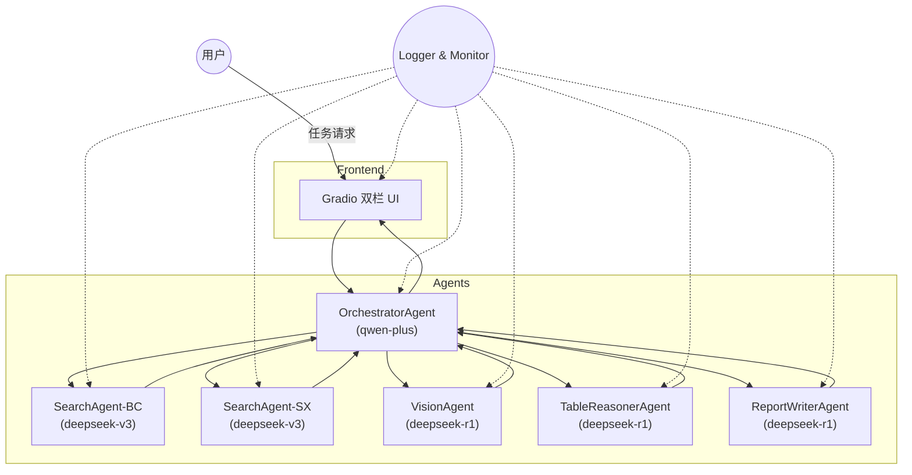

# 智能多体协作研究报告生成系统

> 基于 Autogen 多智能体框架与 Gradio 前端，一键生成带图片、数据推理与引用校验的 Markdown 研究报告。

---

## 功能亮点

- 🔍 **双引擎新闻检索**：集成博查 AI 与 SearXNG，多源保障信息全面性。
- 🖼️ **图片解析**：自动抓取新闻配图，并生成说明文字可直接引用。
- 🧮 **表格推理**：对公开数据计算同比 / 环比，产出 Markdown 表格。
- 🧑‍🤝‍🧑 **多智能体协作**：Orchestrator 按需调度搜索、视觉、推理与写作 Agent，高效并行。
- 🖥️ **Gradio UI**：左右双栏实时展示日志与报告，支持一键下载。
- 📊 **可观测性**：统一日志流 + Prometheus 指标，方便运维监控。

---

## 架构概览



*详细交互时序与技术细节见 `autogen_demo/tech.md`*

---

## 目录结构

```
agent_demo/
├─ autogen_demo/
│  ├─ tech.md            # 技术设计文档
│  ├─ product.md         # 产品设计文档
│  └─ apis.md            # 能力接口说明
├─ core/                 # 多智能体核心实现 (待开发)
├─ ui/                   # Gradio 前端 (待开发)
└─ README.md             # 项目说明
```

> **提示**：`core/` 与 `ui/` 目录将在编码阶段生成，本仓库当前仅包含文档。

---

## 依赖环境

| 组件/库 | 版本要求 | 备注 |
| --- | --- | --- |
| Python | 3.10 | 推荐 `python:3.10-slim` 基础镜像 |
| autogen | >=0.4.0,<0.5.0 | 多智能体框架 |
| gradio | >=4.14.0 | 前端交互 UI |
| requests | ^2.31.0 | 同步 HTTP 调用 |
| httpx | ^0.26.0 | 异步 HTTP 调用（可选） |
| pandas | ^2.2.0 | 表格推理计算 |
| pydantic | ^2.5.0 | 数据模型校验 |
| websockets | ^12.0 | 日志实时推送 |
| beautifulsoup4 | ^4.12.0 | HTML 解析备用 |
| openai | ^1.14.0 | 对接大模型 SDK 封装 |

---

## 快速开始

### 1. 克隆 & 创建虚拟环境

```bash
# 克隆仓库
$ git clone https://github.com/your-org/agent_demo.git && cd agent_demo

# 创建本地虚拟环境 (.venv)
$ python -m venv .venv && source .venv/bin/activate     # Windows: .venv\Scripts\activate

# 使用 uv (更快的 pip 替代) 安装依赖
$ pip install uv
$ uv pip install -r requirements.txt
```

> 若你使用 **Poetry**：`poetry install` 即可。

### 2. 环境变量

```
# 必填，大模型认证 Token
export QWEN_PLUS_TOKEN="sk-d7488c901fc84fd997a4b28a206a355e"

# 可选：日志等级
export LOG_LEVEL="INFO"
```

### 3. 启动服务

```bash
# 启动多智能体后端（FastAPI 示例，待实现）
$ python -m core.server

# 另开终端，启动 Gradio UI
$ python -m ui.app

# 浏览器访问 http://localhost:7860
```

---

## 使用示例

1. 在输入框填入 "生成式 AI 市场前景"。
2. 点击「一键生成」，右侧实时滚动日志，左侧生成报告并提供下载链接。
3. 下载的 Markdown 可直接发布到飞书、Notion 或转换为 PDF。

*示例输出片段*

```markdown
## 最新财经趋势

据《路透社》报道，全球人工智能投资在 2025 年上半年同比增长 45% [1]。


*图 1 生成式 AI 在企业中的应用增长趋势（来源：Gartner[2]）*

| 年份 | 投资额 (亿美元) | 同比增长 |
| ---- | -------------- | -------- |
| 2023 | 685 | - |
| 2024 | 910 | +33% |
| 2025(H1) | 1320 | +45% |
```

---

## 开发指南

- 遵循 *PEP 8* 与本仓库 `Coding Guidelines`。
- 所有函数均需完善 **类型注解** 与 **Google 风格 docstring**。
- 单元测试使用 `pytest`，目标覆盖率 ≥ 90%。
- 提交前运行 `ruff check` & `pytest`。

---

## 部署到生产

### Docker

```dockerfile
FROM python:3.10-slim
WORKDIR /app
COPY . /app
RUN pip install --no-cache-dir -r requirements.txt
ENV QWEN_PLUS_TOKEN="<your-token>"
CMD ["python", "-m", "core.server"]
```

```bash
$ docker build -t report-agent:latest .
$ docker run -p 7860:7860 -e QWEN_PLUS_TOKEN=token report-agent:latest
```

### Kubernetes

- 使用 `Deployment` + `Service`（示例清单见 `deploy/k8s.yaml`）。
- 建议配合 **Grafana + Loki** 收集日志，**Prometheus** 监控 KPI 指标。

---

## 路线图

| 版本 | 功能 | 计划时间 |
| --- | --- | --- |
| V1.0 | 核心多智能体 + Markdown 输出 | 2025 Q3 |
| V1.1 | 章节级摘要 & 图表自动生成 | 2025 Q4 |
| V1.2 | 多人协作编辑 | 2026 Q1 |

---

## 许可证

[MIT](LICENSE)
