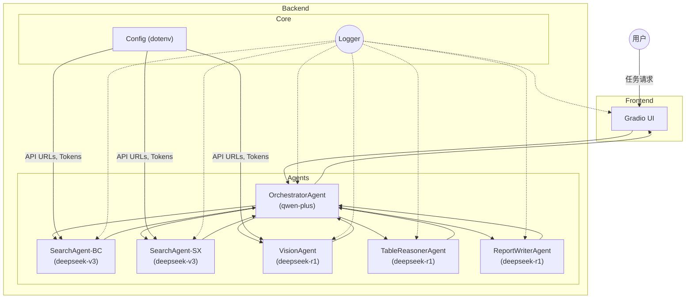
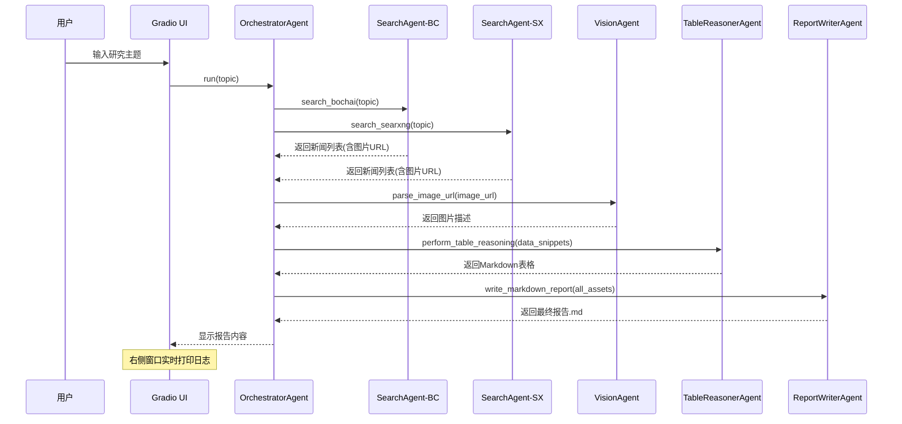

# 技术设计文档

## 1. 概述
本技术设计文档基于《智能多体协作研究报告生成系统产品设计文档》（见 `product.md`）编写，旨在阐述如何使用 **Autogen >=0.4.x** 框架与既有能力接口构建一个可生成研究报告的多智能体系统，并提供前端交互界面、日志体系与安全合规方案。本文档内容包括：系统架构、智能体角色与协作逻辑、能力接口分配、关键实现细节、前端设计及运行维护要点。

---

## 2. 系统整体架构

### 2.1 组件说明
| 模块 | 描述 |
| --- | --- |
| **前端 Gradio** | 提供双栏对话框 UI，左侧显示智能体对话与报告最终内容，右侧实时滚动日志。 |
| **OrchestratorAgent** | 总控代理，负责任务拆解、路由、结果聚合；模型：`qwen-plus`（支持 function-call & reasoning）。 |
| **SearchAgent-BC** | 调用 **博查AI搜索API** 检索新闻和信息；模型：`deepseek-v3`（低成本，不支持 reasoning）。 |
| **SearchAgent-SX** | 调用 **SearXNG搜索API** 检索新闻和信息；模型：`deepseek-v3`。 |
| **VisionAgent** | 解析图片URL并生成描述；调用 **图片解析接口**；模型：`deepseek-r1`（支持 reasoning 与跨模态融合）。 |
| **TableReasonerAgent** | 对结构化数据进行推理补全，生成表格；模型：`deepseek-r1`（支持 reasoning）。 |
| **ReportWriterAgent** | 依据整理好的信息资产撰写最终Markdown报告；模型：`deepseek-r1`（更佳的推理与长上下文能力）。 |
| **配置模块 (config.py)** | 使用 `dotenv` 统一加载环境变量，管理所有API URL和Tokens。 |
| **Logger & Monitor** | 统一封装 Python `logging`；日志流向：终端、文件、前端。 |

### 2.2 系统架构图 （Mermaid）


### 2.3 运行时交互流程 （Mermaid Sequence）


---

## 3. 智能体角色与能力接口映射
| 代理 | 主要职责 | 调用模型 | 能力接口 | 日志级别 |
| --- | --- | --- | --- | --- |
| OrchestratorAgent | 任务拆解、路由、结果聚合 | qwen-plus | Function-Call, Reasoning | INFO |
| SearchAgent-BC | 博查新闻检索 | deepseek-v3 | `博查AI搜索API` | DEBUG |
| SearchAgent-SX | SearXNG 新闻检索 | deepseek-v3 | `SearXNG搜索API` | DEBUG |
| VisionAgent | 图片URL解析与多模态理解 | deepseek-r1 | `图片解析接口` | INFO |
| TableReasonerAgent | 表格推理、同比/环比计算 | deepseek-r1 | 内部推理 | INFO |
| ReportWriterAgent | Markdown 报告撰写 | deepseek-r1 | 内部推理 | INFO |

> **配置管理**：所有API URL及 `qwen-plus` 的Bearer Token等敏感信息，均通过 `.env` 文件进行管理，由 `config.py` 统一加载，避免硬编码。

---

## 4. 关键技术实现

### 4.1 多智能体协作逻辑（Autogen）
```python
# core/agents.py (Conceptual)
groupchat = GroupChat(
    agents=[user_proxy, search_agent_bc, search_agent_sx, vision_agent, table_reasoner_agent, report_writer_agent],
    messages=[],
    max_round=15,
)

manager = GroupChatManager(
    groupchat=groupchat,
    llm_config=qwen_plus_config,
    system_message=(
        "You are the orchestrator. Your job is to manage a team of specialists to produce a research report. "
        "1. **Search**: First, instruct both `SearchAgent_BC` and `SearchAgent_SX` to search for the topic. "
        "2. **Analyze**: Once you have the search results, send all image URLs to `VisionAgent` for analysis, and data snippets to `TableReasonerAgent`. "
        "3. **Synthesize**: After receiving the analyses, gather all information and pass it to the `ReportWriterAgent`. "
        "4. **Finalize**: Instruct `ReportWriterAgent` to write the final report and terminate."
    )
)

user_proxy.initiate_chat(manager, message=f"Generate a report on: {topic}")
```
> 说明：通过 `GroupChatManager` 和精心设计的 `system_message` 来引导协作流程，实现任务的自动分解与执行。

### 4.2 日志体系
1. **统一封装**：基于 Python `logging`，定义一个自定义的 Handler (例如 `QueueHandler`)，将日志记录推送到队列中，供Gradio前端消费和实时渲染。
2. **日志分级**：Orchestrator 及核心推理使用 `INFO`；检索与解析等细节使用 `DEBUG`；异常使用 `ERROR`。可通过环境变量 `LOG_LEVEL` 动态调整。
3. **格式**：`%(asctime)s | %(levelname)s | %(agent)s | %(message)s`。

### 4.3 图片解析与引用
- VisionAgent 调用 `图片解析接口`，输入图片 URL，输出包含 `caption` 和 `tags` 的JSON对象。图片无需下载，直接通过URL处理。
- 报告中引用时，将 `caption` 作为图片描述，示例如下：

```markdown

*图 1: AI机器人团队正在协同工作 (由 VisionAgent 解析)*
```

### 4.4 前端（Gradio）
```python
# ui/app.py (Conceptual)
import gradio as gr
import queue

log_queue = queue.Queue() # 日志队列

def generate_report_and_logs(topic):
    # (启动后端报告生成任务，该任务会将日志放入 log_queue)
    # ...
    # 实时从 log_queue 读取日志并 yield
    # 最终 yield 报告和日志
    pass

with gr.Blocks(theme="soft") as demo:
    with gr.Row():
        with gr.Column(scale=3):
            topic_input = gr.Textbox(label="研究主题")
            start_button = gr.Button("生成报告", variant="primary")
            report_output = gr.Markdown(label="生成的报告")
        with gr.Column(scale=2):
            log_output = gr.Textbox(label="实时日志", lines=30, interactive=False)

    start_button.click(
        fn=generate_report_and_logs,
        inputs=[topic_input],
        outputs=[log_output, report_output],
    )
demo.launch()
```

### 4.5 配置管理
为了安全和灵活性，所有配置（API端点、密钥）都通过环境变量进行管理。
1.  **`.env` 文件**: 在项目根目录创建 `.env` 文件存储敏感信息。
    ```dotenv
    # .env
    BOCHAI_API_URL="https://www.bochai.com/api/v1/search"
    SEARXNG_API_URL="https://searxng.instance/api/search"
    VISION_API_URL="https://vision.api/v1/analyze"
    QWEN_PLUS_TOKEN="sk-d7488c901fc84fd997a4b28a206a355e"
    ```
2.  **`config.py` 模块**: 创建 `core/config.py` 文件，使用 `python-dotenv` 库加载这些变量。
    ```python
    # core/config.py
    from dotenv import load_dotenv
    import os

    load_dotenv() # 加载 .env 文件

    BOCHAI_URL = os.getenv("BOCHAI_API_URL")
    SEARXNG_URL = os.getenv("SEARXNG_API_URL")
    VISION_URL = os.getenv("VISION_API_URL")
    QWEN_TOKEN = os.getenv("QWEN_PLUS_TOKEN")
    ```
3.  **使用**: 在代码中直接从 `core.config` 导入所需配置，实现代码与配置分离。

---

## 5. 安全、合规与性能
1. **接口限流**：在API调用函数中使用 `tenacity` 等库实现重试与退避策略，避免高频请求导致封禁。
2. **异常回退**：若 `博查` 接口故障，`OrchestratorAgent` 应能捕捉异常并指示仅使用 `SearXNG` 的结果；图片解析失败时应记录日志并跳过。
3. **隐私合规**：仅处理公开数据，并在报告中对引用的信息（文章、图片）明确标明来源URL。
4. **性能目标**：单份报告生成时长 ≤ 10 分钟；并发 5 份报告时 CPU 利用率 ≤ 70%。

---

## 6. 部署方案
| 组件 | 运行环境 | 部署方式 |
| --- | --- | --- |
| Agents + FastAPI Server | Python 3.10 | Docker 容器 / Kubernetes Pod |
| Gradio UI | 同上 | 与 FastAPI 服务在同一进程或容器中运行 |
| 日志收集 | Loki / Grafana | （可选）通过 sidecar 容器收集日志 |

---

## 7. KPI 追踪
1. **生成时长**：Prometheus 监控 `report_duration_seconds`。
2. **引用完整率**：Orchestrator 在汇总阶段插桩统计。
3. **图片匹配准确率**：VisionAgent 解析结果与人工抽样对比。

---

## 8. 依赖包版本

| 组件/库 | 版本要求 | 备注 |
| --- | --- | --- |
| Python | 3.10 | 基础环境 |
| autogen | >=0.4.0,<0.5.0 | 多智能体框架 |
| gradio | >=4.14.0 | 前端交互 UI |
| requests | ^2.31.0 | 同步 HTTP 调用 |
| httpx | ^0.26.0 | 异步 HTTP 调用（可选） |
| pandas | ^2.2.0 | 表格推理计算 |
| pydantic | ^2.5.0 | 数据模型校验 |
| python-dotenv | ^1.0.0 | 加载 .env 配置文件 |
| websockets | ^12.0 | 日志实时推送 |
| beautifulsoup4 | ^4.12.0 | HTML 解析备用 |
| openai | ^1.14.0 | 对接大模型 SDK 封装 |

---

## 9. 结语
通过本技术方案，系统可在 **10 分钟内** 生成一份结构化、配图规范、引用可信的研究报告，满足产品文档中对多智能体协作与前端体验的要求。
