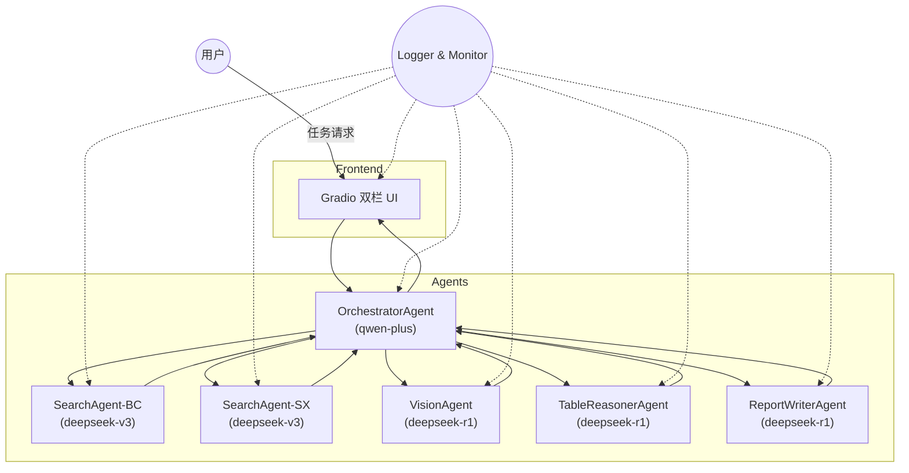
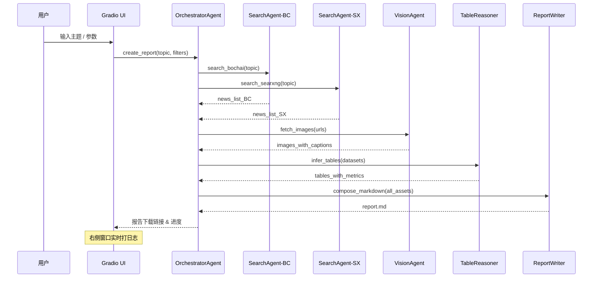

# 技术设计文档

## 1. 概述
本技术设计文档基于《智能多体协作研究报告生成系统产品设计文档》\(见 `product.md`\) 编写，旨在阐述如何使用 **Autogen \>=0.4.x** 框架与既有能力接口构建一个可生成研究报告的多智能体系统，并提供前端交互界面、日志体系与安全合规方案。本文档内容包括：系统架构、智能体角色与协作逻辑、能力接口分配、关键实现细节、前端设计及运行维护要点。

---

## 2. 系统整体架构

### 2.1 组件说明
| 模块 | 描述 |
| --- | --- |
| **前端 Gradio** | 提供双栏对话框 UI，左侧显示智能体对话与报告下载链接，右侧实时滚动日志。 |
| **OrchestratorAgent** | 总控代理，负责任务拆解、路由、结果聚合；模型：`qwen-plus`（支持 function-call & reasoning）。 |
| **SearchAgent-BC** | 调用 **博查 AI 搜索 API**；模型：`deepseek-v3`（低成本；无 reasoning）。 |
| **SearchAgent-SX** | 调用 **SearXNG 搜索 API**；模型：`deepseek-v3`。 |
| **VisionAgent** | 解析图片并生成说明；调用 **图片解析接口**；模型：`deepseek-r1`（支持 reasoning 与跨模态融合）。 |
| **TableReasonerAgent** | 对结构化数据进行推理补全；模型：`deepseek-r1`。 |
| **ReportWriterAgent** | 依据整理结果生成 Markdown 报告；模型：`deepseek-r1`（更佳的推理与长上下文能力）。 |
| **Logger & Monitor** | 统一封装 Python `logging`；日志流向：终端、文件、前端 WebSocket。 |

### 2.2 系统架构图 （Mermaid）


### 2.3 运行时交互流程 （Mermaid Sequence）


---

## 3. 智能体角色与能力接口映射
| 代理 | 主要职责 | 调用模型 | 能力接口 | 日志级别 |
| --- | --- | --- | --- | --- |
| OrchestratorAgent | 任务拆解、路由、结果聚合 | qwen-plus | Function-Call, Reasoning | INFO |
| SearchAgent-BC | 博查新闻检索 | deepseek-v3 | `博查AI搜索API` | DEBUG |
| SearchAgent-SX | SearXNG 新闻检索 | deepseek-v3 | `SearXNG搜索API` | DEBUG |
| VisionAgent | 图片下载与多模态解析 | deepseek-r1 | `图片解析接口` | INFO |
| TableReasonerAgent | 表格推理、同比/环比计算 | deepseek-r1 | 内部推理 | INFO |
| ReportWriterAgent | Markdown 报告撰写 | deepseek-r1 | 内部推理 | INFO |

> **Token 管理**：`qwen-plus` 需在启动时读取环境变量 `QWEN_PLUS_TOKEN=sk-d7488c901fc84fd997a4b28a206a355e`，避免硬编码。

---

## 4. 关键技术实现

### 4.1 多智能体协作逻辑（Autogen）
```python
# core/agents.py
from autogen import Agent, Dialogue, Tool, configure_logging
import logging

configure_logging(level=logging.INFO, stream_to_ui=True)  # 自定义封装，见 4.2 节

class OrchestratorAgent(Agent):
    tools = [
        Tool(name="search_bochai", description="博查搜索", ...),
        Tool(name="search_searxng", description="SearXNG 搜索", ...),
        Tool(name="parse_image", description="图片解析", ...),
    ]

    def run(self, topic: str, filters: dict):
        with Dialogue(self, "生成报告 - {}".format(topic)) as dlg:
            self.log.info("任务拆解 …")
            news_bc = self.call("search_bochai", topic)
            news_sx = self.call("search_searxng", topic)
            images = self.call("parse_image", [n.img for n in news_bc+news_sx])
            tables = self.spawn(TableReasonerAgent).run(news_bc+news_sx)
            markdown = self.spawn(ReportWriterAgent).run(topic, news_bc, news_sx, images, tables)
            dlg.result = markdown
            return markdown
```
> 说明：各 Agent 通过 `spawn()` 或消息通道协同；`Dialogue` 自动记录上下文。

### 4.2 日志体系
1. **统一封装**：基于 Python `logging`，定义 `UIHandler` 将日志推送至 WebSocket，前端右侧对话框实时渲染。
2. **日志分级**：Orchestrator 及核心推理使用 `INFO`；检索与解析使用 `DEBUG`；异常使用 `ERROR`。可通过环境变量 `LOG_LEVEL` 动态调整。
3. **格式**：`%(asctime)s | %(levelname)s | %(agent)s | %(message)s`。

### 4.3 图片解析与引用
- VisionAgent 调用 `图片解析接口`，输入图片 URL，输出：`{"caption": "...", "tags": [...]}`。
- 报告中引用示例：

```markdown

*图 1 多智能体协作示意（由 VisionAgent 解析：机器人 / 协作 / 自动化）*
```

### 4.4 前端（Gradio）
```python
# ui/app.py
import gradio as gr
from core.agents import OrchestratorAgent

orch = OrchestratorAgent()

def start(topic, date_range):
    report_md = orch.run(topic, {"date_range": date_range})
    return gr.Markdown(report_md)

def build_ui():
    with gr.Blocks(title="研究报告生成器") as demo:
        with gr.Row():
            with gr.Column(scale=3):
                topic = gr.Textbox(label="研究主题")
                date = gr.Textbox(label="时间范围 eg: 2024-01-01~2024-12-31")
                start_btn = gr.Button("一键生成")
                report_view = gr.Markdown()
                start_btn.click(start, inputs=[topic, date], outputs=report_view)
            with gr.Column(scale=2):
                log_box = gr.Textbox(label="实时日志", lines=30)
                # WebSocket 推送日志实现略
    demo.launch()
```

---

## 5. 安全、合规与性能
1. **接口限流**：对每个搜索/解析接口设置 QPS ≤ 5，避免被封禁。
2. **异常回退**：若 `博查` 接口故障，自动切到 `SearXNG`；图片下载失败时使用占位符。 
3. **隐私合规**：仅处理公开数据并在引用处标明来源。
4. **性能目标**：单份报告生成时长 ≤ 10 分钟；并发 5 份报告时 CPU 利用率 ≤ 70%。

---

## 6. 部署方案
| 组件 | 运行环境 | 部署方式 |
| --- | --- | --- |
| Agents + APIs | Python 3.10 | Docker 容器 / Kubernetes Pod |
| Gradio UI | 同上 | 与 Agents 同容器或独立 Service |
| 日志收集 | Loki / Grafana | 侧车容器 |

---

## 7. KPI 追踪
1. **生成时长**：Prometheus 监控 `report_duration_seconds`。
2. **引用完整率**：Orchestrator 在汇总阶段插桩统计。
3. **图片匹配准确率**：VisionAgent 解析结果与人工抽样对比。

---

## 8. 依赖包版本

| 组件/库 | 版本要求 | 备注 |
| --- | --- | --- |
| Python | 3.10 | 官方基础镜像 `python:3.10-slim` |
| autogen | >=0.4.0,<0.5.0 | 多智能体框架 |
| gradio | >=4.14.0 | 前端交互 UI |
| requests | ^2.31.0 | 同步 HTTP 调用 |
| httpx | ^0.26.0 | 异步 HTTP 调用（可选） |
| pandas | ^2.2.0 | 表格推理计算 |
| pydantic | ^2.5.0 | 数据模型校验 |
| websockets | ^12.0 | 日志实时推送 |
| beautifulsoup4 | ^4.12.0 | HTML 解析备用 |
| openai | ^1.14.0 | 对接大模型 SDK 封装 |

---

## 9. 结语
通过本技术方案，系统可在 **10 分钟内** 生成一份结构化、配图规范、引用可信的研究报告，满足产品文档中对多智能体协作与前端体验的要求。

> 您好，我是运行在 o3 模型上的 AI 助手，很高兴在 Cursor IDE 中为您提供帮助。
