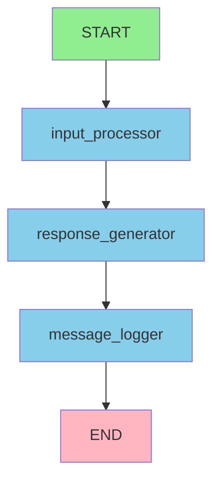

# LangGraph 简单可视化指南

## 📊 概述

本指南介绍如何使用简单的文本和 JSON 格式来显示 LangGraph 工作流图，避免复杂的可视化依赖问题。

## 🎯 为什么使用简单可视化？

### 避免的问题
- ❌ `pygraphviz` 编译错误
- ❌ `matplotlib` 依赖问题  
- ❌ `networkx` 安装困难
- ❌ Microsoft Visual C++ 编译工具需求

### 解决方案
- ✅ 纯 Python 实现
- ✅ 无额外依赖
- ✅ 跨平台兼容
- ✅ 快速部署

## 🚀 快速开始

### 1. 导入工具

```python
from show_graph import quick_show
```

### 2. 显示工作流图

```python
# 创建工作流
workflow = StateGraph(MyState)
workflow.add_node("node_a", node_a)
workflow.add_node("node_b", node_b)
workflow.add_edge("node_a", "node_b")
workflow.add_edge("node_b", END)

# 编译工作流
graph = workflow.compile()

# 显示工作流图
quick_show(graph, "我的工作流", logger)
```

### 3. 查看输出

运行后您将看到：
- 控制台输出：工作流结构信息
- 生成的文件：JSON 和文本格式的工作流信息

## 📋 输出内容

### 1. 控制台输出

```
📊 显示基础概念工作流
============================================================
📋 工作流结构信息:
----------------------------------------
工作流标题: 基础概念工作流
工作流类型: CompiledStateGraph
节点数量: 3
节点列表: ['input_processor', 'response_generator', 'message_logger']
边数量: 3
入口点: input_processor
边连接:
  input_processor → response_generator
  response_generator → message_logger
  message_logger → END

📝 文本形式的工作流图:
----------------------------------------
基础概念工作流
================

START
  ↓
input_processor
  ↓
response_generator  
  ↓
message_logger
  ↓
END

节点说明:
• input_processor: 输入处理节点
• response_generator: 响应生成节点  
• message_logger: 消息记录节点

数据流向:
用户输入 → 输入处理 → 响应生成 → 消息记录 → 输出结果

🔗 Mermaid 代码:
----------------------------------------


📊 工作流摘要:
----------------------------------------
工作流名称: 基础概念工作流
工作流类型: LangGraph StateGraph
节点数量: 3个主要节点 + START/END
执行模式: 顺序执行
数据流向: 线性流程

主要功能:
1. 输入处理 - 处理用户输入
2. 响应生成 - 生成智能体响应  
3. 消息记录 - 记录处理过程

适用场景:
• 简单的对话流程
• 数据处理管道
• 学习 LangGraph 基础概念
```

### 2. 生成的文件

#### JSON 文件 (`基础概念工作流_info.json`)
```json
{
  "title": "基础概念工作流",
  "type": "CompiledStateGraph",
  "nodes": ["input_processor", "response_generator", "message_logger"],
  "edges": [
    {"from": "input_processor", "to": "response_generator", "type": "direct"},
    {"from": "response_generator", "to": "message_logger", "type": "direct"},
    {"from": "message_logger", "to": "END", "type": "direct"}
  ],
  "entry_point": "input_processor",
  "end_points": []
}
```

#### 文本文件 (`基础概念工作流_structure.txt`)
```
工作流: 基础概念工作流
==================================================

节点数量: 3
节点列表: ['input_processor', 'response_generator', 'message_logger']

边数量: 3
边连接:
  input_processor → response_generator
  response_generator → message_logger
  message_logger → END

入口点: input_processor
```

#### Mermaid 文件 (`基础概念工作流_mermaid.md`)
```markdown
# 基础概念工作流 - Mermaid 图


```

## 🛠️ 可用函数

### 1. `quick_show(graph, title, logger=None)`
显示工作流的所有信息（推荐使用）

### 2. `show_workflow_graph(graph, title, logger=None)`
显示基本的工作流结构

### 3. `show_workflow_structure(graph, title, logger=None)`
只显示工作流结构信息

### 4. `show_text_graph(graph, title, logger=None)`
只显示文本形式的工作流图

### 5. `show_simple_mermaid(graph, title, logger=None)`
只生成 Mermaid 代码

### 6. `show_workflow_summary(graph, title, logger=None)`
只显示工作流摘要

### 7. `save_workflow_info(graph, title, logger=None)`
只保存工作流信息到文件

## 📝 使用示例

### 基础示例
```python
from langgraph.graph import StateGraph, END
from show_graph import quick_show

# 定义状态和节点
class MyState(TypedDict):
    messages: List[Any]
    user_input: str

def node_a(state: MyState) -> MyState:
    return {"response": "节点A处理完成"}

def node_b(state: MyState) -> MyState:
    return {"response": "节点B处理完成"}

# 创建工作流
workflow = StateGraph(MyState)
workflow.add_node("node_a", node_a)
workflow.add_node("node_b", node_b)
workflow.set_entry_point("node_a")
workflow.add_edge("node_a", "node_b")
workflow.add_edge("node_b", END)

# 编译和显示
graph = workflow.compile()
quick_show(graph, "基础示例")
```

### 条件边示例
```python
def route_condition(state: MyState) -> str:
    if "a" in state["user_input"]:
        return "route_to_a"
    else:
        return "route_to_b"

workflow.add_conditional_edges(
    "decision_node",
    route_condition,
    {
        "route_to_a": "node_a",
        "route_to_b": "node_b"
    }
)
```

## 🎯 最佳实践

### 1. 使用 `quick_show` 函数
```python
# ✅ 推荐
quick_show(graph, "我的工作流", logger)

# ❌ 不推荐（功能重复）
show_workflow_graph(graph, "我的工作流", logger)
show_simple_mermaid(graph, "我的工作流", logger)
show_workflow_summary(graph, "我的工作流", logger)
```

### 2. 提供有意义的标题
```python
# ✅ 好的标题
quick_show(graph, "用户注册工作流", logger)
quick_show(graph, "数据处理管道", logger)

# ❌ 不好的标题
quick_show(graph, "workflow", logger)
quick_show(graph, "test", logger)
```

### 3. 使用日志器
```python
# ✅ 推荐
import logging
logger = logging.getLogger(__name__)
quick_show(graph, "我的工作流", logger)

# ❌ 也可以（但信息较少）
quick_show(graph, "我的工作流")
```

### 4. 定期更新可视化
```python
# 在工作流修改后重新生成
workflow.add_node("new_node", new_node_func)
workflow.add_edge("existing_node", "new_node")
graph = workflow.compile()
quick_show(graph, "更新后的工作流", logger)
```

## 🔧 故障排除

### 问题1: 无法获取工作流结构
```
获取工作流结构失败: [错误信息]
```

**可能原因：**
- 工作流未正确编译
- 工作流对象类型不支持

**解决方案：**
```python
# 确保工作流已编译
graph = workflow.compile()

# 检查工作流类型
print(type(graph))

# 使用 try-except 处理
try:
    quick_show(graph, "我的工作流", logger)
except Exception as e:
    print(f"可视化失败: {e}")
```

### 问题2: 文件保存失败
```
保存工作流信息失败: [错误信息]
```

**可能原因：**
- 权限问题
- 路径问题
- 磁盘空间不足

**解决方案：**
```python
# 检查当前目录
import os
print(f"当前目录: {os.getcwd()}")

# 使用绝对路径
import os
os.chdir("/path/to/save/directory")
quick_show(graph, "我的工作流", logger)
```

### 问题3: 中文显示问题
```
中文显示为乱码
```

**解决方案：**
```python
# 确保使用 UTF-8 编码
import sys
import io
sys.stdout = io.TextIOWrapper(sys.stdout.buffer, encoding='utf-8')

# 或者在文件开头添加
# -*- coding: utf-8 -*-
```

## 📚 相关资源

- [LangGraph 官方文档](https://langchain-ai.github.io/langgraph/)
- [Mermaid 在线编辑器](https://mermaid.live/)
- [JSON 格式说明](https://www.json.org/)

## 🎉 优势总结

### ✅ 简单易用
- 无需安装额外依赖
- 纯 Python 实现
- 跨平台兼容

### ✅ 功能完整
- 显示工作流结构
- 生成 Mermaid 代码
- 保存多种格式

### ✅ 稳定可靠
- 避免编译问题
- 错误处理完善
- 向后兼容

---

**总结**: 简单可视化工具提供了完整的工作流显示功能，同时避免了复杂的依赖问题，是学习和调试 LangGraph 应用的理想选择。 